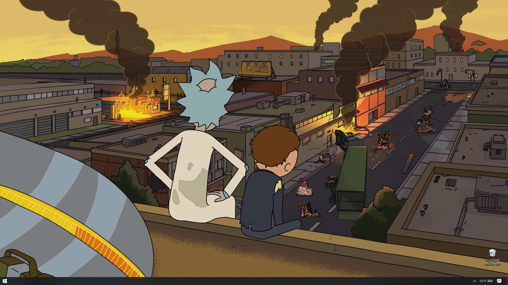

# List of Softwares and Tools that I use on a daily basis.

> This README is generated dynamically by main.py

# Firefox
A free and open-source browser.

- Go to [official download page](https://www.mozilla.org/en-US/firefox/new/) or directly download firefox for windows from [here](https://download.mozilla.org/?product=firefox-stub&os=win&lang=en-us).
# Firefox Developer Edition
Another product of Mozilla that offers cutting edge developer tools and latest features like CSS Grid support and framework debugging.

- Go to [official download page](https://www.mozilla.org/en-US/firefox/developer/) or directly download firefox developer edition for windows from [here](https://download.mozilla.org/?product=firefox-devedition-stub&os=win&lang=en-us).
# Tor
A free and open-source software for enabling anonymous communication.

- Go to [official download page](https://www.torproject.org/download/) or directly download tor for windows from [here](https://www.torproject.org/dist/torbrowser/9.5.4/torbrowser-install-win64-9.5.4_en-us.exe).
# Microsoft Office 365
A line of subscription services offered by Microsoft as part of the Microsoft Office product line.

- Go to [official download page](https://www.microsoft.com/en-us/microsoft-365/microsoft-office).
# Gramarly for Microsoft
write better , clearer Word documents.

- Go to [official download page](https://www.grammarly.com/office-addin) or directly download gramarly for microsoft for windows from [here](https://download-office.grammarly.com/latest/grammarlyaddinsetup.exe).
# GIMP
A free and open-source raster graphics editor used for image retouching and editing,  free-form drawing, converting between different image formats, and more specialized tasks.

- Go to [official download page](https://www.gimp.org/downloads/) or directly download gimp for windows from [here](https://download.gimp.org/mirror/pub/gimp/v2.10/windows/gimp-2.10.20-setup-1.exe).
# Sharex
A free and open-source screenshot and screencast utility.

- Go to [official download page](https://getsharex.com/) or directly download sharex for windows from [here](https://github.com/sharex/sharex/releases/download/v13.2.1/sharex-13.2.1-setup.exe).

- Install Microsoft store version from [here](https://www.microsoft.com/store/productId/9NBLGGH4Z1SP).
# Avdimux
A free video editor designed for simple cutting, filtering an encoding tasks.

- Go to [official download page](https://www.fosshub.com/Avidemux.html) or directly download avdimux for windows from [here](https://www.fosshub.com/avidemux.html?dwl=avidemux_2.7.6vc++64bits.exe).
# OBS Studio
A free and open-source cross-platform streaming and recording program built with Qt.

- Go to [official download page](https://obsproject.com/) or directly download obs studio for windows from [here](https://cdn-fastly.obsproject.com/downloads/obs-studio-25.0.8-full-installer-x64.exe).
# Adobe Premier Pro
A industry-leading video editing software for film, TV, and the web.

- Go to [official download page](https://www.adobe.com/products/premiere.html).
# VLC
A free and open source cross-platform multimedia player and framework.

- Go to [official download page](https://www.videolan.org/vlc/) or directly download vlc for windows from [here](https://get.videolan.org/vlc/3.0.11/win64/vlc-3.0.11-win64.exe).
# Spotify
Music streaming and media services provider.

- Go to [official download page](https://www.spotify.com/us/download/other/) or directly download spotify for windows from [here](https://www.spotify.com/download/windows/).

- Install Microsoft store version from [here](https://www.microsoft.com/store/productId/9NCBCSZSJRSB).
# MusicBee
A freeware media player for playback and organization of audio files.

- Go to [official download page](https://getmusicbee.com/downloads/) or directly download musicbee for windows from [here](https://www.mediafire.com/file/q7xbxr7hipn1ccu/musicbeesetup_3_3_update6.zip/file).

- Install Microsoft store version from [here](https://www.microsoft.com/store/productId/9P4CLT2RJ1RS).
# Discord
A proprietary freeware instant messaging and VoIP application and digital distribution platform designed for creating communities ranging from gamers to education and businesses.

- Go to [official download page](https://discord.com/new/download) or directly download discord for windows from [here](https://discord.com/api/download?platform=win).
# Back Up and Sync from Google
Safely store and share your photos, videos, files and more in the cloud.

- Go to [official download page](https://www.google.com/intl/en-GB_ALL/drive/download/backup-and-sync/).
# Internet Download Manger
A perfect accelerator tool to download your favorite software, games, cd, dvd and mp3 music, movies, shareware and freeware programs much faster.

- Go to [official download page](https://www.internetdownloadmanager.com/download.html) or directly download internet download manger for windows from [here](http://mirror2.internetdownloadmanager.com/idman638build2.exe?b=1&filename=idman638build2.exe).
# IDM trial reset
Use IDM forever without cracking.

- Go to [official download page](https://github.com/J2TEAM/idm-trial-reset/releases) or directly download idm trial reset for windows from [here](https://github.com/j2team/idm-trial-reset/releases/download/v1.0.0/idm.trial.reset.v1.0.0.zip).
# qbittorrent
A free and open-source BitTorrent client.

- Go to [official download page](https://www.qbittorrent.org/download.php) or directly download qbittorrent for windows from [here](https://www.fosshub.com/qbittorrent.html?dwl=qbittorrent_4.2.5_x64_setup.exe).
# WebTorrent
A peer-to-peer streaming torrent client.

- Go to [official download page](https://webtorrent.io/desktop/) or directly download webtorrent for windows from [here](https://webtorrent.io/desktop-download/windows).
# syncthing
A free, open-source peer-to-peer file synchronization application.

- Go to [official download page](https://syncthing.net/downloads/) or directly download syncthing for windows from [here](https://github.com/syncthing/syncthing/releases/download/v1.7.1/syncthing-windows-amd64-v1.7.1.zip).
# KeePass
A free open source password manager a free open source password manager.

- Go to [official download page](https://keepass.info/download.html) or directly download keepass for windows from [here](https://sourceforge.net/projects/keepass/files/keepass%202.x/2.46/keepass-2.46-setup.exe/download).
# 7-Zip
A free and open-source file archiver,  a utility used to place groups of files within compressed containers known as 'archives'.

- Go to [official download page](https://www.7-zip.org/download.html) or directly download 7-zip for windows from [here](https://www.7-zip.org/a/7z1900-x64.exe).
# Sublime Text
A shareware cross-platform source code editor with a Python application programming interface.

- Go to [official download page](https://www.sublimetext.com/3) or directly download sublime text for windows from [here](https://download.sublimetext.com/sublime%20text%20build%203211%20x64%20setup.exe).
# Visual Studio Code
A free source-code editor made by Microsoft for Windows,  Linux and macOS. Features include support for debugging,  syntax highlighting,  intelligent code completion,  snippets,  code refactoring,  and embedded Git.

- Go to [official download page](https://code.visualstudio.com/) or directly download visual studio code for windows from [here](https://aka.ms/win32-x64-user-stable).
# Calibre
A cross-platform open-source suite of e-book software (one stop solution for all your e-book needs).

- Go to [official download page](https://www.fosshub.com/Calibre.html) or directly download calibre for windows from [here](https://www.fosshub.com/calibre.html?dwl=calibre-64bit-4.20.0.msi).
# SumatraPDF
A free and open-source document viewer that supports viewing many document formats as quick and light as possible.

- Go to [official download page](https://www.sumatrapdfreader.org/download-free-pdf-viewer.html) or directly download sumatrapdf for windows from [here](https://www.sumatrapdfreader.org/dl2/sumatrapdf-3.2-64-install.exe).
# Oracle VirtualBox
A free and open-source hosted hypervisor for x86 virtualization.

- Go to [official download page](https://www.virtualbox.org/wiki/Downloads) or directly download oracle virtualbox for windows from [here](https://download.virtualbox.org/virtualbox/6.1.10/virtualbox-6.1.10-138449-win.exe).
# Debian - WSL
Compile and run Unix programs directly in the Windows Environment.

- Directly download Debian - WSL for windows from [here](https://www.microsoft.com/store/apps/9MSVKQC78PK6).
# Windows Terminal
A modern, fast, efficient, powerful, and productive terminal application for users of command-line tools and shells like Command Prompt, PowerShell, and WSL.

- Go to [official download page](https://github.com/microsoft/terminal/releases) or directly download windows terminal for windows from [here](https://www.microsoft.com/store/productid/9n0dx20hk701).
# Microsoft PowerToys
A set of freeware system utilities designed for power users developed by Microsoft for use on the Windows operating system..

- Go to [official download page](https://github.com/microsoft/PowerToys/releases) or directly download microsoft powertoys for windows from [here](https://github.com/microsoft/powertoys/releases/download/v0.21.1/powertoyssetup-0.21.1-x64.msi).
# Rufus
A small application that creates bootable USB drives,  which can then be used to install or run Microsoft Windows,  Linux or DOS.

- Go to [official download page](https://rufus.ie/) or directly download rufus for windows from [here](https://www.fosshub.com/rufus.html?dwl=rufus-3.11p.exe).
# Python3
An interpreted, high-level, general-purpose programming language..

- Go to [official download page](https://www.python.org/downloads/) or directly download python3 for windows from [here](https://www.python.org/ftp/python/3.8.4/python-3.8.4-amd64.exe).
# Git
A free and open source distributed version control system designed to handle everything from small to very large projects with speed and efficiency.

- Go to [official download page](https://git-scm.com/downloads) or directly download git for windows from [here](https://github.com/git-for-windows/git/releases/download/v2.27.0.windows.1/git-2.27.0-64-bit.exe).
# XAMPP
An easy to install Apache distribution containing MariaDB,  PHP, and Perl.

- Go to [official download page](https://www.apachefriends.org/index.html) or directly download xampp for windows from [here](https://www.apachefriends.org/xampp-files/7.4.10/xampp-windows-x64-7.4.10-0-vc15-installer.exe).
# youtube-dl
A small command-line program to download videos from YouTube.com and a few more sites.

- Go to [official download page](https://github.com/ytdl-org/youtube-dl/releases) or directly download youtube-dl for windows from [here](https://github.com/ytdl-org/youtube-dl/releases/tag/2020.09.06).
# FFmpeg
A complete, cross-platform solution to record, convert and stream audio and video.

- Go to [official download page](https://ffmpeg.org/download.html).
# ProtonVPN
A VPN service provider operated by the Swiss company Proton Technologies AG.

- Go to [official download page](https://protonvpn.com/).
# Windows Package Manager CLI (winget)
A comprehensive package manager solution that consists of a command line tool and set of services for installing applications on Windows 10.

## And few others
+ Atom
+ Notepad++
+ Audacity
+ Paint.net
+ Mozilla Thunderbird
+ GNS3
+ Cisco Packet Tracer
+ DB Browser for SQLite

# Android Apps

- Lawchair 2
- ~Pixel pie icon pack~ Pixel Q Icon Pack
- Bose Connect
- eSewa - Mobile Wallet (Nepal)
- Chess - Play and Learn
- Sudoku - The Clean One
- 1.1.1.1 Faster & Safer Internet
- Firefox Browser
- ~Brave Browser~
- Fing - Network Tools
- Flud - Torrent Downloader
- ~Portal - Wifi File Transfer~
- eReader Prestigio: Book Reader
- Xodo PDF Reader & Editor
- Pocket: Save. Read. Grow.
- Dictonary - Marriam-Webster
- Google Keep - Notes and Lists
- Quik - Free Video Editor
- Automatic Tag Editor
- ~Mi Music~ Shuttle Music Player
- XE Currency Converter & Money Transfers
- Mi Calculator
- Free Scientific calculator
- ~Gboard - the Google Keyboard~ Simple Keyboard
- Google (Drive; Photos; Classroom)
- Maps - Navigation & Explore
- Gmail
- WhatsApp Messanger
- ~Relay for Reddit~
- LinkedIn
- ~YouTube~ ~YouTube Vanced~ m.youtube.com
- GitHub
- Termux
- Syncthing
- F-Droid

